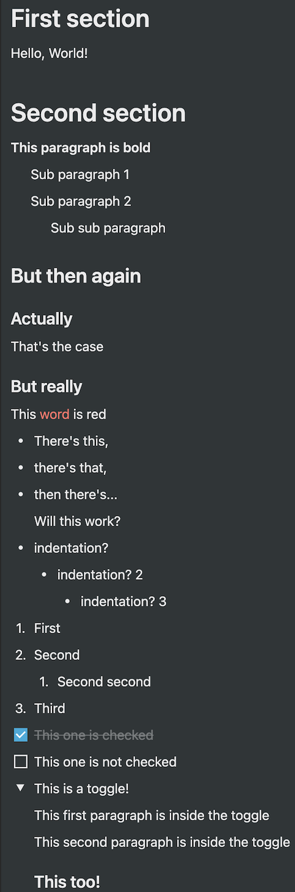

# klibnotion

A [Notion API (currently beta)](https://developers.notion.com/) client library for Kotlin, Java and more.

This library is written in [Kotlin Multiplatform](https://kotlinlang.org/docs/reference/multiplatform.html)
so in theory it can be used from the JVM, Android, iOS, Linux, MacOS, Windows, Javascript and more. In practice it has
been tested and has samples for the JVM (Kotlin and Java), and MacOS (Kotlin).

Several flavors of the client are available to match your needs:

- [Coroutines (`suspend`) based](https://github.com/BoD/klibnotion/blob/master/library/src/commonMain/kotlin/org/jraf/klibnotion/client/NotionClient.kt):
  the default client for Kotlin projects
- [Blocking](https://github.com/BoD/klibnotion/blob/master/library/src/commonMain/kotlin/org/jraf/klibnotion/client/blocking/BlockingNotionClient.kt):
  useful for Java projects, or if you have your own async mechanism
- [`Future` based (JVM only)](https://github.com/BoD/klibnotion/blob/master/library/src/jvmMain/kotlin/org/jraf/klibnotion/client/future/FutureNotionClient.kt):
  useful for Java projects

## Usage

### 1/ Add the dependencies to your project

#### Gradle based projects

The artifact is hosted on the Maven Central repository.

```groovy
repositories {
    /* ... */
    mavenCentral()
}
```

```groovy
dependencies {
    /* ... */
    implementation 'org.jraf:klibnotion:1.9.0'
}
```

### 2/ Use the client

The easiest way to see how to use it is to look at the samples:

- [Coroutines (Kotlin)](samples/sample-jvm/src/main/kotlin/org/jraf/klibnotion/sample/Sample.kt)
- [Blocking (Java)](samples/sample-jvm/src/main/java/org/jraf/klibnotion/sample/BlockingSample.java)
- [Future (Java)](samples/sample-jvm/src/main/java/org/jraf/klibnotion/sample/FutureSample.java)

You can also explore [the docs](https://bod.github.io/klibnotion/).

#### Get your API key

You will find your **Internal Integration Token** by following the
instructions [here](https://developers.notion.com/docs/getting-started).

#### Instantiate a `NotionClient`

```kotlin
val notionClient = NotionClient.newInstance(
    ClientConfiguration(
        Authentication(TOKEN)
    )
)
```

To get other flavors of the client:

- Blocking: `BlockingNotionClient blockingClient = BlockingNotionClientUtils.asBlockingNotionClient(notionClient)`
- Future: `FutureNotionClient futureClient = FutureNotionClientUtils.asFutureNotionClient(notionClient)`

#### Use the `NotionClient`

The client gives access to several API "areas":

- [`oAuth`](https://bod.github.io/klibnotion/klibnotion/org.jraf.klibnotion.client/-notion-client/-o-auth/index.html)
- [`users`](https://bod.github.io/klibnotion/klibnotion/org.jraf.klibnotion.client/-notion-client/-users/index.html)
- [`databases`](https://bod.github.io/klibnotion/klibnotion/org.jraf.klibnotion.client/-notion-client/-databases/index.html)
- [`pages`](https://bod.github.io/klibnotion/klibnotion/org.jraf.klibnotion.client/-notion-client/-pages/index.html)
- [`blocks`](https://bod.github.io/klibnotion/klibnotion/org.jraf.klibnotion.client/-notion-client/-blocks/index.html)

Each area exposes related APIs, for
instance: [`notionClient.pages.getPage`](https://bod.github.io/klibnotion/klibnotion/org.jraf.klibnotion.client/-notion-client/-pages/get-page.html)
.

#### Pagination

The APIs that are paginated all follow the same principle:

- take
  a [`Pagination`](https://bod.github.io/klibnotion/klibnotion/org.jraf.klibnotion.model.pagination/-pagination/index.html)
  object as a parameter, which defines the page to retrieve
- return
  a [`ResultPage<T>`](https://bod.github.io/klibnotion/klibnotion/org.jraf.klibnotion.model.pagination/-result-page/index.html)
  with the result list but also a reference to the next `Pagination` objects (handy when retrieving several pages).

#### Content DSL

A small DSL is available on the page creation API, here's an example usage:

<table>
<tr>
<td>

```kotlin
heading1("First section")
paragraph("Hello, World!")

heading1("Second section")
paragraph("This paragraph is bold", annotations = Annotations.BOLD) {
    paragraph("Sub paragraph 1")
    paragraph("Sub paragraph 2") {
        paragraph("Sub sub paragraph") {

        }
    }
}

heading2("But then again")
heading3("Actually")
paragraph("That's the case")

heading3("But really")
paragraph(RichTextList().text("This ")
    .text("word", Annotations(color = Color.RED))
    .text(" is red"))

bullet("There's this,")
bullet("there's that,")
bullet("then there's...") {
    paragraph("Will this work?")
}
bullet("indentation?") {
    bullet("indentation? 2") {
        bullet("indentation? 3")
    }
}

number("First")
number("Second") {
    number("Second second")
}
number("Third")

toDo("This one is checked", true)
toDo("This one is not checked", false)

toggle("This is a toggle!") {
    paragraph("This first paragraph is inside the toggle")
    paragraph("This second paragraph is inside the toggle")
    heading3("This too!")
}
```

</td>

<td>

</td>
</tr>
</table>

#### OAuth support

1. Use [`oAuth.getUserPromptUri`](https://bod.github.io/klibnotion/klibnotion/org.jraf.klibnotion.client/-notion-client/-o-auth/get-user-prompt-uri.html)
   to get a URI that will prompt users to agree to add your integration to their workspace
2. After agreeing and upon success, they will be redirected to a specific URI containing a code.
   Use [`oAuth.extractCodeAndStateFromRedirectUri`](https://bod.github.io/klibnotion/klibnotion/org.jraf.klibnotion.client/-notion-client/-o-auth/extract-code-and-state-from-redirect-uri.html)
   to extract the code from this URI.
3. Exchange the code for an access token
   using [`oAuth.getAccessToken`](https://bod.github.io/klibnotion/klibnotion/org.jraf.klibnotion.client/-notion-client/-o-auth/get-access-token.html)
4. Save this token. You can now use it by setting
   the [`accessToken`](https://bod.github.io/klibnotion/klibnotion/org.jraf.klibnotion.client/-authentication/access-token.html)
   property of
   the [`Authentication`](https://bod.github.io/klibnotion/klibnotion/org.jraf.klibnotion.client/-authentication/index.html)
   object you used when building
   your [`NotionClient`](https://bod.github.io/klibnotion/klibnotion/org.jraf.klibnotion.client/-notion-client/index.html).

See [the sample](samples/sample-jvm/src/main/kotlin/org/jraf/klibnotion/sample/Sample.kt) for a working example.

#### Logging

To log HTTP requests/response, pass
a [`HttpConfiguration`](https://bod.github.io/klibnotion/klibnotion/org.jraf.klibnotion.client/-http-configuration/index.html)
to [`NotionClient.newInstance()`](https://bod.github.io/klibnotion/klibnotion/org.jraf.klibnotion.client/-notion-client/-companion/new-instance.html?query=fun%20newInstance(configuration:%20ClientConfiguration):%20NotionClient)
.

Several [levels](https://bod.github.io/klibnotion/klibnotion/org.jraf.klibnotion.client/-http-logging-level/index.html)
are available: `NONE`, `INFO`, `HEADERS`, `BODY` and `ALL`

#### Proxy

A proxy can be configured by passing
a [`HttpConfiguration`](https://bod.github.io/klibnotion/klibnotion/org.jraf.klibnotion.client/-http-configuration/index.html)
to [`NotionClient.newInstance()`](https://bod.github.io/klibnotion/klibnotion/org.jraf.klibnotion.client/-notion-client/-companion/new-instance.html?query=fun%20newInstance(configuration:%20ClientConfiguration):%20NotionClient)
.

## Status

- This library uses the `2021-08-16` version of the Notion API.
- The Notion API is still evolving actively and therefore there are some changes that have not been implemented by this
  library yet.
- This library is in active development.
- Pull requests are welcome.

## Javascript support

In theory Kotlin Multiplatform projects can also target Javascript but as of today the author couldn't understand how to
make that work. Please [contact the author](mailto:BoD@JRAF.org) if you want to help :)

## Author and License

*Note: this project is not officially related to or endorsed by Notion.*

```
Copyright (C) 2021-present Benoit 'BoD' Lubek (BoD@JRAF.org)

Licensed under the Apache License, Version 2.0 (the "License");
you may not use this file except in compliance with the License.
You may obtain a copy of the License at

    http://www.apache.org/licenses/LICENSE-2.0

Unless required by applicable law or agreed to in writing, software
distributed under the License is distributed on an "AS IS" BASIS,
WITHOUT WARRANTIES OR CONDITIONS OF ANY KIND, either express or implied.
See the License for the specific language governing permissions and
limitations under the License.
```
