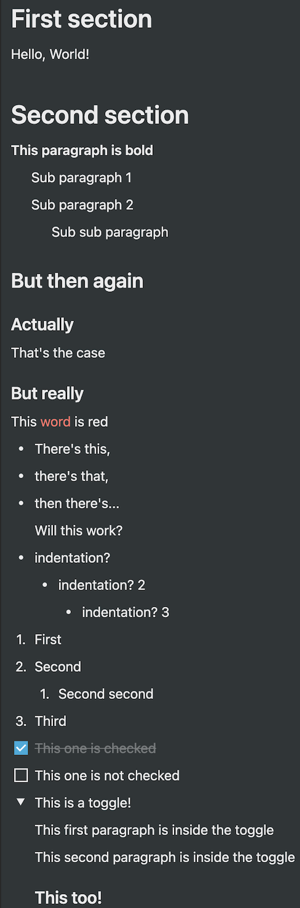

# klibnotion

[](https://central.sonatype.com/artifact/org.jraf/klibnotion)
&nbsp;&nbsp;&nbsp;&nbsp;&nbsp;[](https://central.sonatype.com/repository/maven-snapshots/org/jraf/klibnotion-jvm/maven-metadata.xml)

A [Notion API](https://developers.notion.com/) client library for Kotlin and Java.

This library is written in [Kotlin Multiplatform](https://kotlinlang.org/docs/multiplatform/) and can be used from the JVM (Kotlin and Java), Android, and MacOS native.

Several flavors of the client are available to match your needs:

- [Coroutines (`suspend`) based](https://github.com/BoD/klibnotion/blob/master/library/src/commonMain/kotlin/org/jraf/klibnotion/client/NotionClient.kt): the default client for Kotlin projects
- [Blocking](https://github.com/BoD/klibnotion/blob/master/library/src/commonMain/kotlin/org/jraf/klibnotion/client/blocking/BlockingNotionClient.kt): useful for Java projects, or if you have your own async mechanism
- [`Future` based (JVM only)](https://github.com/BoD/klibnotion/blob/master/library/src/jvmMain/kotlin/org/jraf/klibnotion/client/future/FutureNotionClient.kt): useful for Java projects

## Usage

### 1/ Add the dependencies to your project

#### Gradle based projects

The artifact is hosted on the Maven Central repository.

```kotlin
dependencies {
    implementation("org.jraf:klibnotion:2.0.0")
}
```

### 2/ Use the client

The easiest way to see how to use it is to look at the samples:

- [Coroutines (Kotlin)](samples/sample-jvm/src/main/kotlin/org/jraf/klibnotion/sample/Sample.kt)
- [Blocking (Java)](samples/sample-jvm/src/main/java/org/jraf/klibnotion/sample/BlockingSample.java)
- [Future (Java)](samples/sample-jvm/src/main/java/org/jraf/klibnotion/sample/FutureSample.java)

You can also explore [the reference doc](https://jraf.org/klibnotion/kdoc/).

#### Get your API key

You will find your **Internal Integration Token** by following the
instructions [here](https://developers.notion.com/docs/authorization).

#### Instantiate a `NotionClient`

```kotlin
val notionClient = NotionClient.newInstance(
    ClientConfiguration(
        Authentication(TOKEN)
    )
)
```

To get other flavors of the client (Java):

- Blocking: `BlockingNotionClient blockingClient = BlockingNotionClientUtils.asBlockingNotionClient(notionClient);`
- Future: `FutureNotionClient futureClient = FutureNotionClientUtils.asFutureNotionClient(notionClient);`

#### Use the `NotionClient`

The client gives access to several API areas:

- [`oAuth`](https://jraf.org/klibnotion/kdoc/klibnotion/org.jraf.klibnotion.client/-notion-client/-o-auth/index.html)
- [`users`](https://jraf.org/klibnotion/kdoc/klibnotion/org.jraf.klibnotion.client/-notion-client/-users/index.html)
- [
  `databases`](https://jraf.org/klibnotion/kdoc/klibnotion/org.jraf.klibnotion.client/-notion-client/-databases/index.html)
- [`pages`](https://jraf.org/klibnotion/kdoc/klibnotion/org.jraf.klibnotion.client/-notion-client/-pages/index.html)
- [`blocks`](https://jraf.org/klibnotion/kdoc/klibnotion/org.jraf.klibnotion.client/-notion-client/-blocks/index.html)

Each area exposes related APIs, for instance: [
`notionClient.pages.getPage`](https://jraf.org/klibnotion/kdoc/klibnotion/org.jraf.klibnotion.client/-notion-client/-pages/get-page.html).

#### Pagination

The APIs that are paginated all follow the same principle:

- take a [
  `Pagination`](https://jraf.org/klibnotion/kdoc/klibnotion/org.jraf.klibnotion.model.pagination/-pagination/index.html)
  object as a parameter, which defines the page to retrieve
- return a [
  `ResultPage<T>`](https://jraf.org/klibnotion/kdoc/klibnotion/org.jraf.klibnotion.model.pagination/-result-page/index.html)
  with the result list but also a reference to the next `Pagination` objects (handy when retrieving several pages).

#### Content DSL

A small DSL is available on the page creation API, here's an example usage:

<table>
<tr>
<td>

```kotlin
heading1("First section")
paragraph("Hello, World!")

heading1("Second section")
paragraph("This paragraph is bold", annotations = Annotations.BOLD) {
    paragraph("Sub paragraph 1")
    paragraph("Sub paragraph 2") {
        paragraph("Sub sub paragraph") {

        }
    }
}

heading2("But then again")
heading3("Actually")
paragraph("That's the case")

heading3("But really")
paragraph(RichTextList().text("This ")
    .text("word", Annotations(color = Color.RED))
    .text(" is red"))

bullet("There's this,")
bullet("there's that,")
bullet("then there's...") {
    paragraph("Will this work?")
}
bullet("indentation?") {
    bullet("indentation? 2") {
        bullet("indentation? 3")
    }
}

number("First")
number("Second") {
    number("Second second")
}
number("Third")

toDo("This one is checked", true)
toDo("This one is not checked", false)

toggle("This is a toggle!") {
    paragraph("This first paragraph is inside the toggle")
    paragraph("This second paragraph is inside the toggle")
    heading3("This too!")
}
```

</td>

<td>

</td>
</tr>
</table>

#### OAuth support

1. Build your [
   `NotionClient`](https://jraf.org/klibnotion/kdoc/klibnotion/org.jraf.klibnotion.client/-notion-client/-companion/new-instance.html)
   with a
   `null` [Authentication](https://jraf.org/klibnotion/kdoc/klibnotion/org.jraf.klibnotion.client/-authentication/index.html).
2. Use [
   `oAuth.getUserPromptUri`](https://jraf.org/klibnotion/kdoc/klibnotion/org.jraf.klibnotion.client/-notion-client/-o-auth/get-user-prompt-uri.html)
   to get a URI that will prompt users to agree to add your integration to their workspace
3. After agreeing and upon success, they will be redirected to a specific URI containing a code. Use [
   `oAuth.extractCodeAndStateFromRedirectUri`](https://jraf.org/klibnotion/kdoc/klibnotion/org.jraf.klibnotion.client/-notion-client/-o-auth/extract-code-and-state-from-redirect-uri.html)
   to extract the code from this URI.
4. Exchange the code for an access token using [
   `oAuth.getAccessToken`](https://jraf.org/klibnotion/kdoc/klibnotion/org.jraf.klibnotion.client/-notion-client/-o-auth/get-access-token.html)
5. The `NotionClient` is updated with the token so you can now make authenticated calls. Securely save the token so you
   can pass it to the `authentication` next time you build your `NotionClient`.

See [the sample](samples/sample-jvm/src/main/kotlin/org/jraf/klibnotion/sample/Sample.kt) for a working example.

#### Logging

To log HTTP requests/response, pass a [
`HttpConfiguration`](https://jraf.org/klibnotion/kdoc/klibnotion/org.jraf.klibnotion.client/-http-configuration/index.html)
to [
`NotionClient.newInstance()`](https://jraf.org/klibnotion/kdoc/klibnotion/org.jraf.klibnotion.client/-notion-client/-companion/new-instance.html?query=fun%20newInstance(configuration:%20ClientConfiguration):%20NotionClient).

Several [levels](https://jraf.org/klibnotion/kdoc/klibnotion/org.jraf.klibnotion.client/-http-logging-level/index.html)
are available: `NONE`, `INFO`, `HEADERS`, `BODY` and `ALL`

#### Proxy

A proxy can be configured by passing a [
`HttpConfiguration`](https://jraf.org/klibnotion/kdoc/klibnotion/org.jraf.klibnotion.client/-http-configuration/index.html)
to [
`NotionClient.newInstance()`](https://jraf.org/klibnotion/kdoc/klibnotion/org.jraf.klibnotion.client/-notion-client/-companion/new-instance.html?query=fun%20newInstance(configuration:%20ClientConfiguration):%20NotionClient).

## Status

- This library uses the `2026-03-11` version of the Notion API.
- The Notion API is still evolving and there may be some changes that have not been implemented by this library yet.
- Development on this library is not very active, however, pull requests are very welcome, and new versions will be published as needed.
- If you want to contribute, it is recommended you first try an issue with the ["good first issue"](https://github.com/BoD/klibnotion/issues?q=is%3Aissue+is%3Aopen+label%3A%22good+first+issue%22) label.

## Author and License

*Note: this project is not officially related to or endorsed by Notion.*

```
Copyright (C) 2021-present Benoit 'BoD' Lubek (BoD@JRAF.org)
and contributors (https://github.com/BoD/klibnotion/graphs/contributors)

Licensed under the Apache License, Version 2.0 (the "License");
you may not use this file except in compliance with the License.
You may obtain a copy of the License at

    http://www.apache.org/licenses/LICENSE-2.0

Unless required by applicable law or agreed to in writing, software
distributed under the License is distributed on an "AS IS" BASIS,
WITHOUT WARRANTIES OR CONDITIONS OF ANY KIND, either express or implied.
See the License for the specific language governing permissions and
limitations under the License.
```
